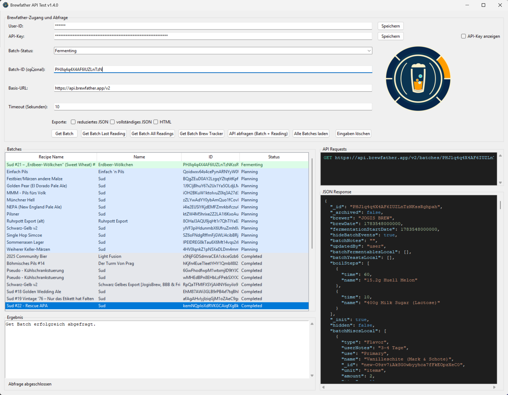

# Brewfather API Testtool

## Zweck

Mit dem Brewfather API Testtool koennen Brewfather-Batches und deren Messdaten
ohne Programmierkenntnisse abgefragt werden. Die grafische Oberflaeche zeigt
die Ergebnisse direkt an und macht gleichzeitig sichtbar, welche API-Requests
gesendet wurden.

Die GUI-Version wird im Fenstertitel angezeigt. Aktuell ist dies:

```text
Brewfather API Test v1.19.0
```

## Starten

### Windows-EXE

Die einfachste Variante ist die fertige EXE:

```text
tools/TestingBrewfatherApi/dist/BrewfatherApiTest.exe
```

Die EXE benoetigt keine Python-Installation.

### Python-Version

Alternativ kann die GUI aus einer Python-Umgebung gestartet werden:

```powershell
cd C:\Projekte\GitHub\BrewSphere\tools\TestingBrewfatherApi
python .\brewfather_gui.py
```

Dafuer werden Python 3, Tkinter und Pillow benoetigt.

### Kommandozeilen-Version

Fuer automatisierte Tests oder technische Diagnose kann weiterhin das CLI-Skript
verwendet werden:

```powershell
python .\test_brewfather_api.py --help
```

Beispiel fuer einen Statusfilter mit Export:

```powershell
python .\test_brewfather_api.py `
  --status Fermenting `
  --save-full-json output\batch.json `
  --save-html output\batch.html
```

Eine konkrete Batch-ID kann direkt angegeben werden:

```powershell
python .\test_brewfather_api.py --batch-id DEINE_BATCH_ID
```

Alle CLI-Optionen und Rueckgabecodes sind in `README.md` dokumentiert.

## Zugangsdaten

### Automatisches Laden aus `config_local.h`

Bei Verwendung der EXE die Datei direkt neben die EXE legen:

```text
dist/
  BrewfatherApiTest.exe
  config_local.h
```

Die Datei muss mindestens diese beiden Defines enthalten:

```cpp
#define BREWFATHER_USER_ID "DEINE_USER_ID"
#define BREWFATHER_API_KEY "DEIN_API_KEY"
```

Beim Start werden die Werte automatisch geladen. Die Datei wird nicht in die
EXE eingebettet und darf nicht weitergegeben oder committed werden.

### Eingabe in der GUI

User-ID und API-Key koennen auch direkt in den beiden Eingabefeldern eingetragen
werden. Mit dem jeweiligen **Speichern**-Button wird nur der betreffende Wert
in `config_local.h` geschrieben.

Der API-Key wird standardmaessig verdeckt. Mit **API-Key anzeigen** kann die
Eingabe kontrolliert werden.

## Fermentationsprofil

Nach einer erfolgreichen **Get Batch**-Abfrage wird aus dem Abschnitt
`fermentation.steps` ein Temperaturprofil gezeichnet.

- X-Achse: `stepTime` in Tagen
- Y-Achse: `stepTemp` in °C
- Temperaturbereich: `0..30 °C`
- horizontale Gitternetzlinien: alle `2 °C`
- Kurvenfarbe: Rot
- direkte Verbindung der Punkte ohne Interpolation
- jeder Datenpunkt wird mit einem roten Marker gekennzeichnet
- Y-Achse ab `0 °C`, Maximum dynamisch drei Grad ueber dem hoechsten Datenpunkt
  und auf das naechste gerade Vielfache von `2 °C` aufgerundet
- ein letzter Schritt mit `stepTime=99` wird auf 5 Tage durchgezogen und einen
  weiteren Tag gestrichelt dargestellt

Die einzelnen Steps werden in der Reihenfolge der API-Antwort verbunden. Das
Diagramm passt sich automatisch an die Fensterbreite an. Fehlende oder
ungueltige Step-Werte werden ignoriert. Wenn keine Fermentationsdaten vorhanden
sind, bleibt der Diagrammbereich leer.

Unter dem Diagramm werden die erkannten Steps in einer Tabelle angezeigt:

| Spalte | Inhalt |
|---|---|
| `ActualTime (Berlin)` | `actualTime` als deutsche Ortszeit fuer Berlin |
| `StepTime` | Dauer des einzelnen Schritts in Tagen |
| `StepTimeKumiliert` | Kumulierte Zeit seit Beginn |
| `StepTemp` | Temperatur des Schritts in °C |
| `Name` | Name des Fermentationsschritts |
| `displayPressure` | Angezeigter Druck |
| `Type` | Brewfather-Schritttyp |

Der Unterreiter **Maischen** verwendet den Abschnitt `recipe.mash.steps` und ist
analog aufgebaut. Die X-Achse zeigt dort Minuten, da `stepTime` bei
Maischschritten in Minuten angegeben wird. Das Maischprofil wird als
Stufendiagramm gezeichnet: Die Temperatur wird für die gesamte `StepTime` des
aktuellen Schritts gehalten und wechselt erst am Ende dieser Phase auf die
Temperatur des nächsten Schritts. Die Maisch-Step-Tabelle enthält nur
`StepTime`, `StepTimeKumiliert`, `StepTemp` und `Name`.

Die Y-Achse des Maischdiagramms beginnt bei 50 °C. Zusätzlich sind zwei
Temperaturbereiche im Diagrammhintergrund markiert: 60–65 °C für
`Beta-Amylase` in blassem Gelb und 70–75 °C für `Alpha-Amylase` in blassem
Blau.

## GUI-Uebersicht

Die Oberflaeche ist in einen Eingabebereich, eine Batch-Tabelle, einen
Ergebnisbereich sowie einen rechten Reiterbereich aufgeteilt.

Der rechte Bereich besitzt aktuell zwei Hauptreiter:

- **API-Request/-Response** mit gesendeten Requests und JSON-Antwort
- **Diagramm** mit den Unterreitern **Fermentation** und **Maischen**

Weitere Funktionsbereiche koennen spaeter als zusaetzliche Reiter ergaenzt
werden.

Das BrewSphere-Emblem wird im Eingabebereich und als Fenster-/Taskleistenicon
angezeigt.

### GUI-Screenshot

Die folgende Aufnahme zeigt die wichtigsten Bereiche der Anwendung. Die darin
verwendeten Zugangsdaten und Batchdaten sind reine Beispieldaten:



## Eingabefelder

### User-ID und API-Key

Diese Werte werden fuer die HTTP-Basic-Authentifizierung gegen Brewfather
verwendet. Der API-Key benoetigt mindestens den Scope:

```text
batches.read
```

### Batch-Status

Der Statusfilter wird fuer die Auswahl des ersten passenden Batches verwendet.
Verfuegbare Werte:

- `Brewing`
- `Fermenting`
- `Conditioning`
- `Planning`
- `Completed`
- `Archived`

### Batch-ID

Die Batch-ID wird fuer die vier direkten Batch-Abfragen benoetigt. Sie kann
manuell eingetragen oder durch einen Doppelklick auf eine Zeile in der
Batch-Tabelle uebernommen werden.

### Basis-URL

Standardwert:

```text
https://api.brewfather.app/v2
```

Die Basis-URL kann fuer kompatible Testserver oder Proxies angepasst werden.

### Timeout

Der Timeout wird in Sekunden angegeben. Standardwert ist `10`.

## Batch-Tabelle

Mit **Alle Batches laden** werden alle Batches des Kontos abgerufen. Die API
liefert maximal 50 Batches pro Antwort; weitere Seiten werden automatisch ueber
`start_after` geladen.

Die Tabelle enthaelt diese Spalten:

1. `Recipe Name`
2. `Name`
3. `ID`
4. `Status`

Die Sortierung erfolgt zuerst nach Status:

1. `Brewing`
2. `Fermenting`
3. `Conditioning`
4. `Planning`
5. `Completed`
6. `Archived`

Innerhalb eines Status wird zusaetzlich alphabetisch nach `Recipe Name`
sortiert. Unbekannte Statuswerte stehen am Ende.

### Statusfarben

Jeder Status hat eine eigene Zeilenfarbe:

| Status | Farbe | Bedeutung |
|---|---|---|
| `Brewing` | Orange | Batch wird gebraut |
| `Fermenting` | Gruen | Batch befindet sich in der Gaerung |
| `Conditioning` | Violett | Batch befindet sich in der Reifung/Konditionierung |
| `Planning` | Blau | Batch ist geplant |
| `Completed` | Grau | Batch ist abgeschlossen |
| `Archived` | Schiefergrau | Batch wurde archiviert |

Ein Doppelklick auf eine Zeile uebernimmt die ID dieser Zeile in das Feld
`Batch-ID (optional)`.

## API-Abfragen

### Get Batch

Ruft die Stammdaten eines Batches ab:

```text
GET /v2/batches/<BATCH_ID>
```

### Get Batch Last Reading

Ruft nur den letzten gespeicherten Messwert ab:

```text
GET /v2/batches/<BATCH_ID>/readings/last
```

Diese Funktion ist fuer einen schnellen Funktionstest meistens die beste Wahl.

Wenn ein Batch noch keinen Messwert besitzt, wird dies als normaler Zustand
angezeigt. Ein HTTP-404 von `/readings/last` bedeutet in diesem Fall nicht,
dass der Batch nicht existiert.

### Get Batch All Readings

Ruft alle gespeicherten Messwerte eines Batches ab:

```text
GET /v2/batches/<BATCH_ID>/readings
```

Die Antwort kann bei langen Gaerungen sehr gross werden. Diese Funktion ist
vor allem fuer Diagnose und Sensorhistorien gedacht.

### Get Batch Brew Tracker

Ruft die Brew-Tracker-Daten eines Batches ab:

```text
GET /v2/batches/<BATCH_ID>/brewtracker
```

## JSON Response

Der rechte Bereich **JSON Response** zeigt die zuletzt geladene API-Antwort
formatiert und eingerueckt an.

Syntax-Highlighting unterscheidet:

- JSON-Schluessel
- Textwerte
- Zahlen
- `true`, `false` und `null`

Der Bereich besitzt vertikale und horizontale Scrollleisten. Bei grossen
Antworten, insbesondere bei **Get Batch All Readings**, kann die Anzeige sehr
umfangreich werden.

## API Requests

Im Bereich **API Requests** werden die tatsaechlich gesendeten GET-Requests
angezeigt. Das ist besonders hilfreich fuer:

- die Kontrolle des verwendeten Batch-Endpunkts
- die Kontrolle von Statusfiltern
- die Kontrolle der `start_after`-Paging-Requests
- die Diagnose von HTTP-Fehlern

User-ID und API-Key werden aus Sicherheitsgruenden nicht angezeigt.

## Exportfunktionen

Die allgemeine Abfrage bietet optionale Exporte:

- reduziertes JSON
- vollstaendiges JSON
- HTML mit aufklappbaren Antwortbereichen

Beim Aktivieren eines Exports wird nach dem Speicherort gefragt. Private Batch-,
Rezept- und Sensordaten sollten nicht ungeschuetzt weitergegeben werden.

## Typische Ablaeufe

### Schneller API-Test

1. GUI starten.
2. Pruefen, ob User-ID und API-Key geladen wurden.
3. Eine Batch-ID eintragen oder einen Batch laden.
4. **Get Batch Last Reading** klicken.
5. Request und JSON Response pruefen.

### Einen Batch untersuchen

1. **Alle Batches laden** klicken.
2. Gewuenschte Zeile anhand von Recipe Name, Name und Status suchen.
3. Zeile doppelt anklicken.
4. **Get Batch** klicken.
5. Bei Bedarf **Get Batch All Readings** oder **Get Batch Brew Tracker** klicken.

### Alle Batches pruefen

1. Zugangsdaten pruefen.
2. **Alle Batches laden** klicken.
3. Paging-Requests im Bereich **API Requests** beobachten.
4. Ergebnisse nach Status und Recipe Name kontrollieren.

## Fehlerbehebung

### Zugangsdaten fehlen

User-ID und API-Key eintragen oder eine gueltige `config_local.h` neben die EXE
legen.

### HTTP 401

User-ID oder API-Key sind ungueltig.

### HTTP 403

Der API-Key besitzt vermutlich nicht den Scope `batches.read`.

### HTTP 404 bei Last Reading

Der Batch existiert, besitzt aber noch keinen letzten Messwert. Fuer weitere
Details zuerst **Get Batch** ausfuehren.

### HTTP 404 bei All Readings oder Brew Tracker

Der gewaehlte Batch besitzt moeglicherweise keine Messhistorie oder keine
Brew-Tracker-Daten. Die exakte URL im Bereich **API Requests** pruefen.

### Keine Batches gefunden

Statusfilter pruefen oder stattdessen **Alle Batches laden** verwenden.

### Timeout

Timeout erhoehen, zum Beispiel auf `30` Sekunden. Bei **Get Batch All Readings**
kann eine grosse Messhistorie laenger dauern.

## Datenschutz

Folgende Dateien koennen private Zugangsdaten oder Brewdaten enthalten:

- `config_local.py`
- `config_local.h`
- JSON-Exporte
- HTML-Exporte

Diese Dateien nicht committen oder unverschluesselt weitergeben. Die lokalen
Konfigurationsdateien und generierten Exportdateien sind im Projekt bereits
ueber `.gitignore` ausgeschlossen.
